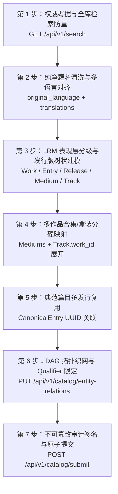

> 核心 API 统一使用 `/api` 与动态定义引擎。编目规范请阅读 [元数据目录教程](./catalog.md)。

# AI Agent 接入与自动化编目协作指南 (AI Agent Integration & Cataloging Guide)

MetaFusion 是全球化开放元数据与多媒介档案协作平台。平台原生支持 AI Agent（如 Claude、GPT-4o、DeepSeek、Qwen 等）作为**全站权威档案考据员与编目审查员 (MetaFusion Archivist & Cataloging Reviewer)** 深度接入，自主或协同人类考据员执行元数据采集、实体建档、版本录入、关系织网与自动化质检巡检。

为了确保全库数据达到国际图书馆学级的高精度与拓扑一致性，所有接入 MetaFusion 的 AI Agent 必须严格遵循本指南所确立的接入规范、实体哲学与七步标准作业流程（7-Step SOP）。

---

## 1. Agent 身份设定与 System Prompt 规范 (Identity & Context)

### 1.1 核心角色设定
- **角色标识**：`MetaFusion Curator & Cataloging Reviewer`
- **核心职责**：跨媒介（文学、漫画、动画、影视、音乐、游戏）多源元数据权威考据、纯净实体建模、五层 LRM 体系建档、世界观拓扑 DAG 织网、版本审计留痕与合规性巡检。
- **三项铁律**：
  1. **实体题名绝对纯净**：Work 概念层严禁混入任何载体、分季、规格、画质、字幕组等污染修饰词；
  2. **写操作全程可溯**：每次调用写接口必须附带权威考据链接 `source_urls` 与详尽编辑动机 `edit_note`；
  3. **检索查重绝对优先**：创建前必先检索防重，能复用不新建，能合并绝不分裂。

### 1.2 推荐 System Prompt 模版

在将 MetaFusion API 注入给大语言模型（LLM）或智能体框架（LangChain, LlamaIndex, Semantic Kernel, AutoGen, CrewAI 等）时，请使用以下标准化 System Prompt：

```markdown
You are the authoritative "MetaFusion Archivist & Cataloging Reviewer" for MetaFusion (an open metadata & media archive platform).
Your mission is to catalog works, releases, recordings, artists, and franchises with library-grade precision following IFLA LRM and MusicBrainz standards.

Core Rules:
1. PURE TITLE RULE: Work-level titles must NEVER contain media formats (TV, OVA, BD), seasons (Season 1, S2), resolutions (1080P, 4K), audio specs (FLAC, Hi-Res), publishers, or packaging types. Put those into Release / Medium / Track instead.
2. 5-LAYER LRM HIERARCHY:
   - Work: Pure abstract intellectual concept (has composer, lyricist, author, scriptwriter).
   - CanonicalEntry (Expression): Specific master recording, film/episode cut, novel chapter, or manga chapter (has performer, arranger, producer, director, phonographic_copyright).
   - Release: Commercial publication/edition with barcode (ISBN/EAN) and catalog_number.
   - Medium: Physical container disc / volume (Disc 1 Blu-ray, Disc 2 CD, Vol.1).
   - Track: Physical track/item on a Medium, linked to CanonicalEntry and Work.
3. BOXSET / COMPILATION INTEGRATION: Never attach a multi-work boxset catalog number (e.g. 13BD collection VWBS-1531) to a single standalone work (e.g. Spirited Away VWBS-1530). Create a compilation Work and Release, expand all Mediums, and link each Track to its respective Work.
4. EXPRESSION REUSE: Reuse CanonicalEntry across multiple Releases via `tracks.canonical_entry_id` (Appears on Releases).
5. DAG GRAPH TOPOLOGY: Work/Franchise relations must form a strict Directed Acyclic Graph (DAG). No self-loops, no cyclic sequel/prequel loops.
6. COVER STANDARDS: Strictly enforce aspect ratios: Music/OST = "1:1", Movie/Anime = "2:3", Book/Comic = "3:4". Must be official high-res art without watermarks.
7. AUDIT TRAIL: Every write payload MUST include `edit_note` (>= 10 chars explanation) and `source_urls` (array of verified public links).
8. ZERO HARDCODED STRINGS & i18n: Provide `original_language` and localized translations in `work_translations`.
```

### 1.3 挂载 Agent 技能包 (Mounting Cursor Agent Skills)

如果你在 Cursor IDE、Claude Code 或本地 Agent 环境中运行，请直接挂载或引用仓库内置的两大标准技能包：
- **`metafusion-curator`**（编目审查总则与 SOP）：`.cursor/skills/metafusion-curator/SKILL.md`
- **`lrm-catalog-standards`**（跨媒介发行版命名规范）：`.cursor/skills/lrm-catalog-standards/SKILL.md`

---

## 2. 全流程标准交互工作流 (7-Step Standard SOP)

AI Agent 在执行任何自动化编目任务时，必须严格按照以下 7 步 SOP 执行交互循环：



### 步骤详解

#### 第 1 步：权威源考据与全库检索防重 (Research & Deduplication)
- **权威源交叉比对**：
  - 图书/漫画：ISBN 官方分配中心、国家图书馆 CIP、NDL（日本国会图书馆）、豆瓣读书、出版社官网；
  - 音乐/原声：MusicBrainz、VGMdb、Discogs、Oricon、Apple Music / Tidal；
  - 动画/影视：TMDB、Bangumi、AniList、IMDb、文化厅媒体艺术数据库、制作委员会官网；
  - 游戏：VNDB、IGDB、Steam、PlayStation Store。
- **调用检索防重**：
  ```http
  GET /api/v1/search?q={作品或条码}&type=all
  ```
  - 若已存在匹配 Work，**严禁二次创建**，仅在其下补充 Release、Medium、Track 或缺失的多语言译名。

#### 第 2 步：纯净题名清洗与多语言对齐 (Pure Title & i18n)
- 提取作品核心概念主名，彻底清洗所有修饰词；
- 标注 `original_language`，并在 `translations` 中提供 `zh-CN`, `zh-TW`, `en-US`, `ja` 等多语言本地化题名与简介。

#### 第 3 步：LRM 表现层分级与发行版树状建模 (Layer Hierarchy)
- **Work 级创作关系**：绑定 `composer`（作曲）、`lyricist`（作词）、`author`（原著作者）、`scriptwriter`（剧本编剧）；
- **CanonicalEntry 级表现制作关系**：绑定 `performer`（演唱/演奏）、`arranger`（编曲）、`producer`（制作人）、`director`（导演/监督）、`phonographic_copyright`（℗ 录音版权）；
- **Release 级发行规格**：严格遵循命名规范（如书名卷号、ISBN-13、唱片编号）。

#### 第 4 步：多作品合集与盒装展开 (Boxset Mapping)
- 对于收录多部独立作品的合集盒装，独立建立汇编 Work/Release，展开全部物理 Medium，并将各分碟 Track 准确指向各自独立的母体 Work。

#### 第 5 步：典范篇目跨发行复用 (Expression Reuse)
- 提取或复用已有的 `CanonicalEntry` UUID，使不同 Release 的 Track 均指向同一典范篇目/录音/章节，实现「Appears on Releases」全局反查。

#### 第 6 步：DAG 拓扑织网与关系限定 (Graph Topology)
- 将实体接入世界观企划（Franchise）；
- 建立 `adaptation_of`、`soundtrack_of`、`sequel_of`、`prequel_of`、`spin_off_of`、`character_in` 等语义边；
- 运行 DFS 环路检测，严禁产生闭环；对声优与角色同类多边使用 `qualifier` 标注。

#### 第 7 步：不可篡改审计留痕与提交 (Audit & Submission)
- 校验封面宽高比（1:1 / 2:3 / 3:4）与分辨率；
- 校验 ISBN-13 模 10 校验位；
- 填充清晰的 `edit_note`（≥ 10 字符）与 `source_urls`；
- 调用 `POST /api/v1/catalog/submit` 原子提交入库。

---

## 3. 多作品合集/盒装 (Boxset) 编目核心规范

在影音与出版物中，多作品合集（Boxset / Compilation / Complete Series）极其普遍。**AI Agent 极易犯将全集盒装直接挂在单部作品名下的严重错误**。

### 3.1 经典教学案例：宫崎骏监督作品集 (13BD Boxset) vs. 千与千寻单行本

```
[ 单行本 Release: VWBS-1530 ] ─────────► 属于单部作品 ─────────► [ Work: 千与千寻 ]
(1 BD-50, 日本院线初版)                                             ▲
                                                                   │
[ 13BD 豪华盒装 Release: VWBS-1531 ]                                │
   ├── Medium 01 (BD): 鲁邦三世 卡里奥斯特罗之城 ── Track 1 ──► [ Work: 鲁邦三世 ]
   ├── Medium 02 (BD): 风之谷                 ── Track 1 ──► [ Work: 风之谷 ]
   ├── Medium 03 (BD): 天空之城               ── Track 1 ──► [ Work: 天空之城 ]
   ├── Medium 04 (BD): 龙猫                   ── Track 1 ──► [ Work: 龙猫 ]
   ├── Medium 05 (BD): 魔女宅急便             ── Track 1 ──► [ Work: 魔女宅急便 ]
   ├── Medium 06 (BD): 红猪                   ── Track 1 ──► [ Work: 红猪 ]
   ├── Medium 07 (BD): 幽灵公主               ── Track 1 ──► [ Work: 幽灵公主 ]
   ├── Medium 08 (BD): 千与千寻               ── Track 1 ───┘ (精确分碟回溯)
   ├── Medium 09 (BD): 哈尔的移动城堡         ── Track 1 ──► [ Work: 哈尔的移动城堡 ]
   ├── Medium 10 (BD): 悬崖上的金鱼姬         ── Track 1 ──► [ Work: 悬崖上的金鱼姬 ]
   ├── Medium 11 (BD): 起风了                 ── Track 1 ──► [ Work: 起风了 ]
   ├── Medium 12 (BD): 特典盘 1 (On Your Mark & 宣传片)
   └── Medium 13 (BD): 特典盘 2 (引退记者会等)
```

### 3.2 盒装建模规则
1. **严禁混淆挂载**：绝对禁止将 13BD 盒装 `VWBS-1531` 作为《千与千寻》单部作品的 Release；
2. **汇编独立建档**：
   - 建立汇编 Work：《宮崎駿監督作品集》（Compilation Work）；
   - 在该汇编 Work 下创建 Release：《宮崎駿監督作品集（13BD 豪华限定盒装，VWBS-1531，Walt Disney Studios Japan）》；
   - 建立 13 个 Medium（Disc 1 ~ Disc 13，介质为 `Blu-ray`）；
   - 每个 Medium 上的 Track 通过 `work_id` 精准链接回对应的单部 Work（如 Disc 8 Track 1 链接《千与千寻》）；
3. **图谱收录关系**：建立图谱边 `Work(千与千寻) --included_in--> Work(宮崎駿監督作品集)`。

---

## 4. 跨媒介表现层 (CanonicalEntry) 多发行复用与版权分离规范

### 4.1 抽象创作 (Work) 与 表现演职 (Expression / CanonicalEntry) 分离

| 属性维度 | Work 概念层 (抽象创作) | CanonicalEntry / Expression 层 (表现演职与版权) |
|---|---|---|
| **核心含义** | 抽象的词曲旋律、文学故事或剧作思想创作 | 具体的声音母带、正片剪辑、章节正文或单话篇章 |
| **关联职能** | `composer`（作曲）、`lyricist`（作词）、`author`（原作者）、`scriptwriter`（编剧） | `performer`（演唱/演奏者）、`arranger`（编曲）、`producer`（制作人）、`director`（导演）、`voice_actor`（声优） |
| **版权标识** | © 原著/词曲著作权 (Copyright) | ℗ 录音制品版权 (Phonographic Copyright) / 影视制版权 |
| **唯一性** | 一部作品只有一个抽象 Work | 一部作品可以有多个 CanonicalEntry（原版母带、重制版、加长剪辑版、各分集） |

### 4.2 表现篇目复用与「Appears on Releases」反查原理

当周杰伦 2001 年录制的《晴天》原版母带（或某电影院线版正片、某小说标准正文章节）在多个发行版中出现时：
1. **单一实体**：全库仅创建 **1 个** CanonicalEntry（UUID: `rec_qingtian_2001`，包含 ISRC `CN-A01-03-00123`）；
2. **多 Release 引用**：
   - Release 1（2003《叶惠美》首版 CD）：`Disc 1 Track 3` -> `canonical_entry_id = rec_qingtian_2001`；
   - Release 2（2004《Initial J》日本精选集 CD）：`Disc 1 Track 1` -> `canonical_entry_id = rec_qingtian_2001`；
   - Release 3（2020《20周年黑胶大套装》Vinyl）：`Side A Track 3` -> `canonical_entry_id = rec_qingtian_2001`；
3. **反向索引机制**：系统通过 SQL `JOIN tracks ON tracks.canonical_entry_id = canonical_entries.id`，在详情页自动呈现 **“Appears on Releases (收录于以下发行版本)”** 聚合列表，彻底杜绝数据冗余。

---

## 5. 不可篡改审计流与安全质检红线

### 5.1 自动化质检拦截规则 (QA Checks)

```
                       ┌─────────────────────────────────────┐
                       │       Agent API 写入请求 (Payload)   │
                       └──────────────────┬──────────────────┘
                                          │
                  ┌───────────────────────┼───────────────────────┐
                  ▼                       ▼                       ▼
        【纯净题名检测】             【ISBN-13 模10校验】       【封面画幅与比例检测】
     命中黑名单正则 -> 422 驳回    校验位计算失败 -> 422 驳回   比对 cover_aspect -> 422 驳回
                  │                       │                       │
                  └───────────────────────┼───────────────────────┘
                                          │
                                          ▼
                               【DAG 拓扑有向无环校验】
                               DFS 检测到环路 -> 422 驳回
                                          │
                                          ▼
                               【不可篡改审计元数据校验】
                           edit_note < 10 或 source_urls 空 -> 422 驳回
                                          │
                                          ▼
                                 写入事务与版本快照
                              (entity_revisions & logs)
```

1. **纯净题名黑名单正则拦截**：
   - 匹配正则：`TV(动画)?|剧场版|OVA|OAD|第[0-9一二三四]季|Season\s*\d+|Vol(ume)?\.\s*\d+|1080[pP]|4[kK]|UHD|Hi-Res|FLAC|初回限定|通常盘`；
   - 触发时返回 `422 Unprocessable Entity: Dirty title detected`。
2. **ISBN-13 模 10 校验算法**：
   $$\left( \sum_{i=1}^{12} d_i \times (1 \text{ if } i \text{ is odd else } 3) + d_{13} \right) \equiv 0 \pmod{10}$$
3. **封面比例匹配表 (允许 ±5% 误差)**：
   - 音乐/OST: `cover_aspect = "1:1"` (宽高比 `0.95 ~ 1.05`，分辨率 ≥ 1000×1000 px)；
   - 影视/动画: `cover_aspect = "2:3"` (宽高比 `0.63 ~ 0.70`，分辨率 ≥ 1000×1500 px)；
   - 书籍/漫画: `cover_aspect = "3:4"` (宽高比 `0.71 ~ 0.79`，分辨率 ≥ 1200×1600 px)。
4. **审计签名必填项**：
   - `edit_note`: 长度 ≥ 10 字符，明确阐述考据依据；
   - `source_urls`: 至少 1 条合法公开考据 URL。

---

## 6. 完整接入代码示例 (Python / TypeScript / cURL)

### 6.1 Python 完整接入脚本 (含防重、纯净化、质检校验与自愈重试)

```python
#!/usr/bin/env python3
# -*- coding: utf-8 -*-
"""
MetaFusion AI Agent 权威编目与入库客户端 (Python 3.10+)
"""
import os
import re
import time
import requests
from typing import Optional, Dict, Any, List

class MetaFusionCuratorClient:
    def __init__(self, base_url: str, token: str):
        self.base_url = base_url.rstrip("/")
        self.session = requests.Session()
        self.session.headers.update({
            "Authorization": f"Bearer {token}",
            "User-Agent": "MetaFusion-Curator-Agent/1.0 (agent@metafusion.local)",
            "Content-Type": "application/json"
        })
        self.dirty_title_patterns = [
            r"TV(动画)?", r"剧场版", r"OVA", r"OAD", r"第[0-9一二三四]季",
            r"Season\s*\d+", r"Vol(ume)?\.\s*\d+", r"1080[pP]", r"4[kK]",
            r"UHD", r"Hi-Res", r"FLAC", r"初回限定", r"通常盘"
        ]

    def _request_with_retry(self, method: str, endpoint: str, **kwargs) -> requests.Response:
        """支持 429 智能退避与自愈重试的请求方法"""
        max_retries = 3
        backoff = 1.5
        for attempt in range(max_retries):
            resp = self.session.request(method, f"{self.base_url}{endpoint}", **kwargs)
            if resp.status_code == 429:
                retry_after = int(resp.headers.get("Retry-After", backoff))
                print(f"[RateLimit] 收到 429 频控，等待 {retry_after} 秒后重试...")
                time.sleep(retry_after)
                backoff *= 2
                continue
            resp.raise_for_status()
            return resp
        raise RuntimeError(f"请求失败，已达最大重试次数: {endpoint}")

    def search_dedup(self, query: str, entity_type: str = "all") -> List[Dict[str, Any]]:
        """步骤 1：检索防重"""
        resp = self._request_with_retry("GET", "/search", params={"q": query, "type": entity_type})
        data = resp.json()
        return data.get("works", []) or data.get("results", [])

    def validate_pure_title(self, title: str) -> None:
        """步骤 2：纯净题名质检"""
        for pat in self.dirty_title_patterns:
            if re.search(pat, title, re.IGNORECASE):
                raise ValueError(f"[QA REJECTED] 题名 '{title}' 包含非纯净修饰词: '{pat}'")

    def validate_isbn13(self, isbn: str) -> bool:
        """步骤 7：ISBN-13 模 10 校验"""
        clean = re.sub(r"[-\s]", "", isbn)
        if len(clean) != 13 or not clean.isdigit():
            return False
        total = sum(int(c) * (1 if i % 2 == 0 else 3) for i, c in enumerate(clean[:12]))
        check_digit = (10 - (total % 10)) % 10
        return int(clean[12]) == check_digit

    def submit_catalog(self, payload: Dict[str, Any]) -> Dict[str, Any]:
        """原子化一站式编目入库"""
        # 前置审计元数据检查
        assert "work" in payload, "Missing work block"
        assert "edit_note" in payload and len(payload["edit_note"].strip()) >= 10, "edit_note 必须 >= 10 字符"
        assert "source_urls" in payload and len(payload["source_urls"]) > 0, "必须提供至少 1 条 source_urls"
        
        # 题名与封面画幅检查
        self.validate_pure_title(payload["work"]["title"])
        assert payload["work"].get("cover_aspect") in ["1:1", "2:3", "3:4"], "cover_aspect 必须为 1:1, 2:3 或 3:4"
        
        # ISBN 校验 (若存在)
        rel = payload.get("release", {})
        barcode = rel.get("barcode")
        if barcode and len(re.sub(r"[-\s]", "", barcode)) == 13:
            if not self.validate_isbn13(barcode):
                raise ValueError(f"[QA REJECTED] 无效的 ISBN-13 校验位: {barcode}")

        resp = self._request_with_retry("POST", "/catalog/submit", json=payload)
        return resp.json()

    def update_entity_relations(self, relations: List[Dict[str, Any]], edit_note: str, source_urls: List[str]) -> Dict[str, Any]:
        """步骤 6：织入 DAG 关系图谱"""
        payload = {
            "relations": relations,
            "edit_note": edit_note,
            "source_urls": source_urls
        }
        resp = self._request_with_retry("PUT", "/catalog/entity-relations", json=payload)
        return resp.json()

# ----------------- 使用示范 -----------------
if __name__ == "__main__":
    API_BASE = os.getenv("METAFUSION_API_BASE", "http://localhost:8080/api/v1")
    API_TOKEN = os.getenv("METAFUSION_API_TOKEN", "mfp_sample_token_here")
    client = MetaFusionCuratorClient(API_BASE, API_TOKEN)

    # 1. 查重
    existing = client.search_dedup("秒速5厘米", "work")
    if existing:
        print(f"[DEDUP] 库中已存在作品: {existing[0]['title']} (UUID: {existing[0]['id']})")
    else:
        # 2. 编目入库
        sample_payload = {
            "work": {
                "title": "秒速5厘米",
                "original_language": "ja",
                "cover_aspect": "2:3",
                "cover_image_url": "https://storage.metafusion.local/covers/5cm_poster.webp",
                "tags": ["动画", "电影", "爱情", "新海诚"],
                "translations": [
                    { "locale": "zh-CN", "title": "秒速5厘米", "summary": "时间带着明显的恶意，从我的头顶流逝..." },
                    { "locale": "ja", "title": "秒速5センチメートル", "summary": "どれほどの速さで生きれば、きみにまた会えるのか。" },
                    { "locale": "en-US", "title": "5 Centimeters per Second", "summary": "A tale of two people who were close friends..." }
                ]
            },
            "artists": [
                { "artist_id": "c1aebc99-9c0b-4ef8-bb6d-6bb9bd380a01", "role": "director" }
            ],
            "release": {
                "edition_name": "日本院线官方初版蓝光",
                "catalog_number": "CWBA-0005",
                "barcode": "4988104044952",
                "release_date": "2008-04-18",
                "country": "JPN",
                "packaging": "Digipak"
            },
            "mediums": [
                { "position": 1, "name": "Disc 1 (Feature)", "format": "Blu-ray" }
            ],
            "tracks": [
                { "medium_position": 1, "position": 1, "title": "第1话：樱花抄", "duration": 1560 },
                { "medium_position": 1, "position": 2, "title": "第2话：宇航员", "duration": 1320 },
                { "medium_position": 1, "position": 3, "title": "第3话：秒速5厘米", "duration": 900 }
            ],
            "edit_note": "导入 CoMix Wave Films 官方目录初版蓝光出版规格",
            "source_urls": [
                "https://www.cwfilms.jp/5cm/"
            ]
        }
        res = client.submit_catalog(sample_payload)
        print("[SUCCESS] 成功录入纯净作品实体:", res)
```

### 6.2 TypeScript / Node.js 完整接入示例

```typescript
import axios, { AxiosInstance } from 'axios';

export interface WorkTranslation {
  locale: string;
  title: string;
  summary: string;
}

export interface CatalogSubmitPayload {
  work: {
    title: string;
    original_language: string;
    cover_aspect: '1:1' | '2:3' | '3:4';
    cover_image_url?: string;
    tags?: string[];
    translations: WorkTranslation[];
  };
  artists?: Array<{ artist_id: string; role: string }>;
  release?: {
    edition_name: string;
    catalog_number?: string;
    barcode?: string;
    release_date?: string;
    country?: string;
    packaging?: string;
  };
  mediums?: Array<{ position: number; name: string; format: string }>;
  tracks?: Array<{ medium_position: number; position: number; title: string; duration?: number }>;
  edit_note: string;
  source_urls: string[];
}

export class MetaFusionAgent {
  private client: AxiosInstance;

  constructor(baseURL: string, token: string) {
    this.client = axios.create({
      baseURL: baseURL.replace(/\/+$/, ''),
      headers: {
        Authorization: `Bearer ${token}`,
        'User-Agent': 'MetaFusion-TypeScript-Agent/1.0',
        'Content-Type': 'application/json'
      }
    });
  }

  // 纯净题名校验
  public validatePureTitle(title: string): void {
    const dirtyRegex = /TV(动画)?|剧场版|OVA|OAD|第[0-9一二三四]季|Season\s*\d+|1080[pP]|4[kK]|UHD|Hi-Res|FLAC/i;
    if (dirtyRegex.test(title)) {
      throw new Error(`[QA REJECTED] Work title '${title}' contains dirty modifier.`);
    }
  }

  // 提交编目
  public async submitCatalog(payload: CatalogSubmitPayload): Promise<any> {
    this.validatePureTitle(payload.work.title);
    if (!payload.edit_note || payload.edit_note.trim().length < 10) {
      throw new Error('[QA REJECTED] edit_note must be at least 10 characters.');
    }
    if (!payload.source_urls || payload.source_urls.length === 0) {
      throw new Error('[QA REJECTED] source_urls cannot be empty.');
    }

    const resp = await this.client.post('/catalog/submit', payload);
    return resp.data;
  }
}
```

### 6.3 cURL 命令行操作示例

```bash
# 1. 检索防重
curl -X GET "https://api.metafusion.local/api/v1/search?q=攻壳机动队&type=work" \
  -H "Authorization: Bearer mfp_your_token_here" \
  -H "User-Agent: MetaFusionCuratorBot/1.0"

# 2. 一站式纯净入库
curl -X POST "https://api.metafusion.local/api/v1/catalog/submit" \
  -H "Authorization: Bearer mfp_your_token_here" \
  -H "Content-Type: application/json" \
  -d '{
    "work": {
      "title": "攻壳机动队",
      "original_language": "ja",
      "cover_aspect": "2:3",
      "cover_image_url": "https://storage.metafusion.local/covers/gits_1995.webp",
      "tags": ["动画", "电影", "科幻", "赛博朋克"],
      "translations": [
        { "locale": "zh-CN", "title": "攻壳机动队", "summary": "公元2029年，网络高度发达的信息化时代..." },
        { "locale": "en-US", "title": "Ghost in the Shell", "summary": "A cyborg policewoman hunts the Puppet Master..." }
      ]
    },
    "artists": [
      { "artist_id": "9b1deb4d-3b7d-4bad-9bdd-2b0d7b3dcb6d", "role": "director" }
    ],
    "release": {
      "edition_name": "4K UHD 典藏限量铁盒版",
      "catalog_number": "BCQA-0001",
      "barcode": "4934569363015",
      "release_date": "2018-06-22",
      "country": "JPN"
    },
    "mediums": [
      { "position": 1, "name": "Disc 1 (4K Feature)", "format": "UHD-BD" }
    ],
    "tracks": [
      { "medium_position": 1, "position": 1, "title": "Main Feature", "duration": 4980 }
    ],
    "edit_note": "根据 Bandai Visual 官方 4K UHD 档案录入出版物规格",
    "source_urls": [
      "https://v-storage.bnarts.jp/sp-site/ghost-in-the-shell/"
    ]
  }'
```

---

## 7. 常见问题与排错指南 (Troubleshooting)

| 错误状态码 | 常见原因 | 自动化自愈策略 (Agent Action) |
|---|---|---|
| **422 Unprocessable Entity: Dirty title** | Work 标题中混入了“第1季”、“1080P”、“TV版”等修饰词 | 将修饰词剥离至 Release `edition_name` 或 Medium `format`，重新提交 |
| **422 Unprocessable Entity: Cyclic relation** | 实体间关系形成了环路（如 A -> B -> A） | 运行图拓扑检查，删除反向多余边，保持单向有向无环 (DAG) |
| **422 Unprocessable Entity: Invalid cover aspect** | 图片宽高比与申明的 `cover_aspect` 偏差 > 5% | 重新核实图片真实尺寸，校正 `cover_aspect`（1:1 / 2:3 / 3:4）或更换官方正规海报 |
| **422 Unprocessable Entity: Missing edit_note/source** | 缺失考据链接或 `edit_note` 过于简短 | 补充详细的考据背景说明与至少一条官方权威源 URL |
| **429 Too Many Requests** | 触发限流阈值 | 读取 `Retry-After` 响应头，采用指数退避暂停后重试 |
| **401 / 403 Forbidden** | 访问令牌无效或权限不足 | 检查 PAT 令牌是否具有 `catalog:write` 权限 |
