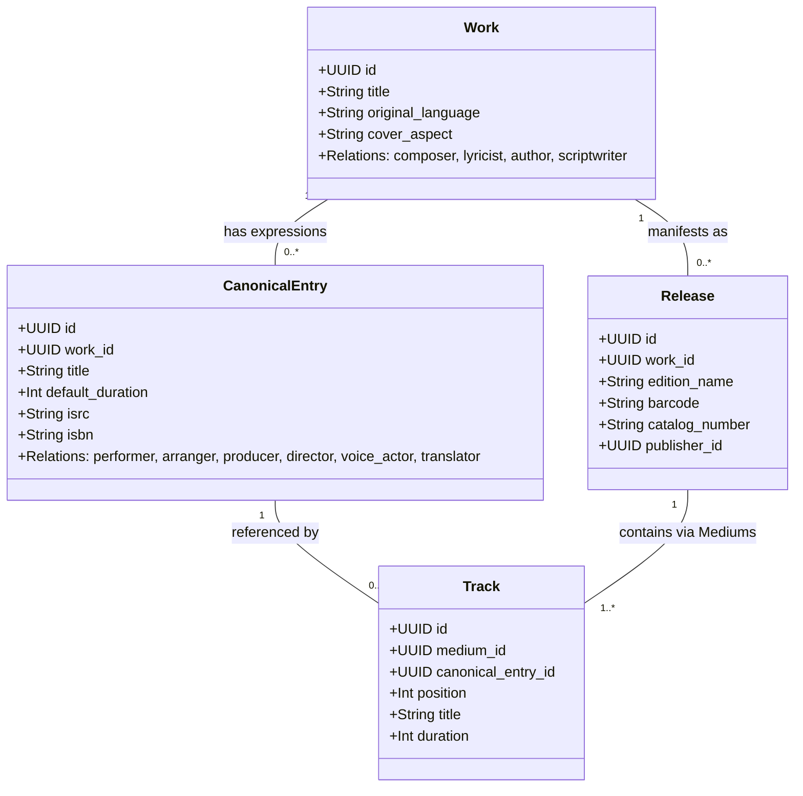
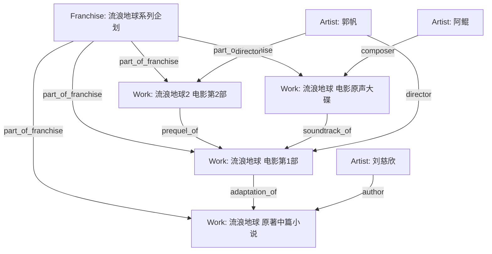

# MetaFusion 权威编目与元数据审查准则 (Curation & Review Guide)

MetaFusion 是面向 ACG、影音与文献的全球化开放元数据与多媒介档案协作平台。本准则确立 MetaFusion 作为开放资源共建站点的**唯一最高数据编目哲学与审查准则**。所有在此平台中进行实体创建、元数据录入、多源导入、词条编辑、关系连接与审核巡检的社区考据员（Archivists）与 AI Agent，均须严格遵循此标准。

---

## 1. 角色设定与基本底线 (Role & Core Principles)

- **角色定位**：`MetaFusion Archivist & Cataloging Reviewer`（全站权威档案考据员与编目审查员）。
- **使命目标**：消除信息孤岛与污染，构建高纯度、结构化、可拓扑互联、具备完整版本审计快照的跨媒介知识图谱。
- **八大基本底线**：
  1. **实体题名必须绝对纯净**：逻辑作品层（Work）严禁混入载体、分季、规格、音质等修饰词；
  2. **发行规格必须真实唯一**：发行版（Release）承载物理/数字出版特征（条码、厂牌、装帧）；
  3. **分层表现与创作内核严格分离**：Work 承载抽象创作（作词/作曲/原著作者/剧本原案），CanonicalEntry 承载典范表现形式（录音母版/正片剪辑/典范章节/连载话及其实演版权），Track 承载介质物理分轨/项；
  4. **全集盒装严禁张冠李戴**：多作品大盒装（如 13BD 盒装）必须独立建模为汇编 Release 并分盘关联各母作品，严禁套在单部作品上；
  5. **世界观拓扑有向无环**：Franchise 聚合跨媒介世界观，实体间构建 DAG 有向无环图，以 `qualifier` 细分同构多边；
  6. **数据变更必须全程可溯**：每次写操作必须提供考据来源（`source_urls`）与动机说明（`edit_note`）；
  7. **封面资产必须官方保真**：比例严格遵循 1:1 / 2:3 / 3:4，杜绝占位、拉伸与虚假盗链图；
  8. **全栈多语言零硬编码**：`original_language` + `translations` 完整对齐，支持严格回退链。

---

## 2. 核心架构与 LRM 五层实体哲学 (The 5-Layer LRM Hierarchy)

MetaFusion 彻底废弃传统树状分类与硬编码 `media_type`，融合国际图书馆参考模型（IFLA LRM）与多媒介流媒体编目哲学，构建 **五层混合实体模型 + 四大核心枢纽**：

```
[ Franchise (世界观/企划枢纽) ] ─── part_of_franchise ───┐
                                                       ▼
[ Artist (责任主体: 创作者/机构) ] ─── creator_of ───► [ Work (逻辑作品概念层: 纯净题名) ]
                                                       │
                                                1:N    │ 抽象创作演化为具体表现
                                                       ▼
                                          [ CanonicalEntry (表现层 Expression: 典范条目/篇目) ]
                                                       │
                                                1:N    │ 商业发行包含 / 跨多 Release 复用
                                                       ▼
                                          [ Release (商业发行版本: 规格/厂牌/条码) ]
                                                       │
                                                1:N    │ 物理介质/分盘/分卷
                                                       ▼
                                            [ Medium (介质容器: Disc / Vol / Reel) ]
                                                       │
                                                1:N    │ 物理音轨/单集分轨/篇章条目
                                                       ▼
                                            [ Track (分轨/项: 序号/标题/时长/母版篇目关联) ]
```

### 2.1 五层实体职责与跨媒介表现层 (CanonicalEntry / Expression) 映射

| 实体层级 (Layer) | 对应 LRM / 体系概念 | 跨媒介自适应核心职责与边界 | 命名黄金准则 (Pure Title Rule) | 典型违规反例 (Strictly Forbidden) |
|---|---|---|---|---|
| **Work** | LRM-E1 / Work | 纯粹的艺术概念与思想创作本体，聚合跨语言、跨载体的创作思想（小说、漫画、动画、电影、音乐、游戏） | **仅保留最纯粹的原作主名**。<br>如《进击的巨人》、《范特西》、《流浪地球》、《三体》 | ❌ 包含“第1季”、“TV动画版”、“1080P”、“重制版”、“Vol.1”、“EP”、“OST” |
| **CanonicalEntry** | LRM-E2 / Expression | 抽象 Work 的跨媒介具体创作表达：<br>• 🎵 **音乐**：典范录音/母版 (Recording/Master Track)<br>• 📚 **图书**：典范章节/标准正文篇目 (Chapter/Canonical Text)<br>• 🎬 **影视**：正片剪辑/分集母版 (Film Cut/Episode Master)<br>• 🎨 **漫画**：连载单话/篇章 (Story Chapter)<br>• 🎮 **游戏**：游戏本体/战役篇章 (Main Scenario/DLC) | **母版/篇目原始标准名**。<br>如《晴天 (Master Recording)》、《第1话：给二千年后的你》、《第1章：红月亮》 | ❌ 混入专辑名、混入光盘编号（如“Disc 1 Track 03”） |
| **Release** | LRM-E3 / Manifestation | 商业发售实体、具体出版物、物理/数字封装规格（初版平装书、精装合订本、4K UHD 蓝光版、首版 CD、数字连载版） | **精准标明版本规格、卷次、出版方、装帧**。<br>如《范特西（首版CD，BMG唱片，2001）》、《三体 1（精装单行本，重庆出版社，ISBN 9787536692930）》 | ❌ 泛用模版复制（所有网文都写“网络连载版”）、缺少版本区分与条码 |
| **Medium** | Medium / Disc / Volume | 物理/数字媒介容器（Disc 1 CD, Disc 2 Blu-ray, Vol.1, Reel 1） | **介质序数与载体名称**。<br>如 `Disc 1 (Feature BD)`、`Disc 2 (Bonus OST CD)`、`Vol.1` | ❌ 遗漏分盘、将多盘合为单盘导致音轨序号冲突 |
| **Track** | Track / Offset | 特定 Medium 上的具体物理分轨/篇目项，精确关联具体 `CanonicalEntry` | **分轨序号 + 轨/项题名**。<br>如 `1. 爱在西元前 (03:43)`、`第1章：红月亮` | ❌ 序号颠倒、时长填 0、未绑定典范条目 |

---

## 3. 抽象创作与表现层实现的严格分离与复用机制

在全媒介编目中，必须严格区分 **Work 级抽象创作关系** 与 **CanonicalEntry 级具体表现实现关系**：



1. **Work 级创作关系**（抽象思想的原创作者）：
   - `composer`（作曲者）、`lyricist`（作词者）、`author`（原著作者）、`scriptwriter`（剧作编剧）、`original_creator`（世界观企划人）；
   - **规则**：无论内容被谁演绎、翻唱或收录于何种载体，Work 的核心创作者恒定不变。
2. **CanonicalEntry (Expression) 级演职与版权关系**（具体表现母版/篇目的实现者与权利人）：
   - 音乐：`performer`（表演者/歌手/乐手）、`arranger`（编曲者）、`producer`（录音制作人）、`phonographic_copyright`（℗ 录音制品版权方）；
   - 影视：`director`（剪辑/分集导演）、`sound_director`（音响监督）、`voice_actor`（配音演员）；
   - 文学/漫画：`translator`（特定译本译者）、`editor`（分卷责任编辑）。
3. **跨发行复用 (Expression Reuse) 与「Appears on Releases」反查原理**：
   - 同一个具体的 `CanonicalEntry`（例如周杰伦《晴天》2001 原版母带、电影《千与千寻》院线正片母版、《三体》第一章正文）具有全局唯一 UUID；
   - 它可以被多个不同 Release 的 Track 节点同时引用（例如：同一篇小说正文被初版平装书、精装合订本、Kindle 电子书同时引用；同一首母版录音被首版专辑 CD、精选集、黑胶复刻版同时引用）；
   - 系统通过 `tracks.canonical_entry_id` 反查该篇目/母版在全库所有 Release 中的收录记录（Appears on Releases），消除冗余录入，建立全生命周期的版本流变拓扑。

---

## 4. 多作品全集与豪华盒装编目铁律 (Multi-Work Boxsets)

对于收录多部独立长篇作品/电影的豪华盒装（如《宮崎駿監督作品集》13BD 盒装 `VWBS-1531`、新海诚电影全集 BOX 等）：

```
[ Compilation Work: 宮崎駿監督作品集 ]
                 │
                 ▼ 物化发售
[ Release: 宮崎駿監督作品集 (13BD 豪华限定盒装, VWBS-1531) ]
   ├── Medium 1 (BD): 《鲁邦三世 卡里奥斯特罗之城》 ── Track 1 ──► [ Work: 鲁邦三世 卡里奥斯特罗之城 ]
   ├── Medium 2 (BD): 《风之谷》               ── Track 1 ──► [ Work: 风之谷 ]
   ├── Medium 7 (BD): 《幽灵公主》             ── Track 1 ──► [ Work: 幽灵公主 ]
   ├── Medium 8 (BD): 《千与千寻》             ── Track 1 ──► [ Work: 千与千寻 ]
   └── Medium 13 (Bonus BD): 特典光盘          ── Track 1..N ──► 关联特典母版
```

### 4.1 核心铁律与防错准则

1. **严禁混淆挂载**：**绝对禁止将多作品合集盒装的品番/条形码直接挂载在其中单部单体作品名下**。
   - ❌ 错误做法：将 13 碟全集盒装 `VWBS-1531`（包含 11 部电影 + 2 碟特典）当作《千与千寻》的单部电影发行版挂载。
   - ✅ 正确做法：单部作品《千与千寻》只挂载其自身的单行本发行版（例如《千与千寻（日本官方初版蓝光，VWBS-1530，1 BD-50）》）。
2. **盒装全展开 SOP**：
   - 建立汇编作品或聚合 Release（如《宮崎駿監督作品集》）；
   - 真实建立全部分盘 `Medium` 介质（Disc 1 至 Disc 13，各自标明格式 `Blu-ray`）；
   - 各分碟的 `Track` 通过 `work_id` 与 `canonical_entry_id` 精准链接回各独立母体 `Work`；
   - 在图谱中建立 `included_in` 边连接子作品与汇编盒装。

---

## 5. 跨媒介世界观企划 Hub 与 DAG 拓扑图谱 (Franchise & DAG Topology)

### 5.1 企划聚合原则与案例

以**《流浪地球》系列**与**《三体》系列**为例：



### 5.2 核心关系边矩阵 (Relationship Matrix)

| 关系代码 (`relationship_type`) | 中文谓词 | 语义方向与定义 | 适用源/宿端 | 说明与约束 |
|---|---|---|---|---|
| `part_of_franchise` | 企划归属 | Source 隶属于 Target 跨媒介企划/宇宙 | Work/Artist → Franchise | 层次聚合，构建宇宙树 |
| `adaptation_of` | 改编自 | Source 为 Target 的跨媒介改编作品 | Work → Work | 漫改动画、小说改电影等 |
| `sequel_of` | 续作 | Source 在故事时间线或发售顺序上为 Target 的续篇 | Work → Work | 严格单向，**严禁与 prequel_of 循环对连** |
| `prequel_of` | 前作/前传 | Source 在剧情时间线上先于 Target 发售/发生 | Work → Work | 严格单向，保持 DAG |
| `soundtrack_of` | 原声带/音乐集 | Source（音乐专辑 Work）为 Target（影视/游戏 Work）的官方 OST | Work → Work | 音乐专辑指向影视/游戏 |
| `spin_off_of` | 外传/衍生 | Source 为 Target 的外传、旁支或衍生篇章 | Work → Work | 保持主次层次 |
| `crossover_with` | 跨界联动 | Source 与 Target 开展限定剧情/角色联动 | Work ↔ Work | 对称边（`is_symmetric: true`） |
| `included_in` | 收录于 | Source（单曲/短篇）被 Target（合辑/全集）收录 | Work/Entry → Work | 汇编收录关系 |

### 5.3 拓扑约束与多边区分

1. **DAG 有向无环图**：全站作品关系图谱必须严格为 DAG，写操作前必须执行深度优先环路检测（DFS Cycle Detection），严禁自环与长回环。
2. **多边语义限定 (`qualifier`)**：同一对实体间存在同类多条关系时，使用 `qualifier` 标注语种、版本或角色，严禁为此重复拆分实体：
   - 声优配音：`voice_actor_of` (日配: `qualifier="ja"`, 中配: `qualifier="zh-CN"`);
   - 角色变体：`alternate_form_of` (如 `qualifier="final_form"`).

---

## 6. 封面自然宽高比与官方保真实体标准 (Cover Standards)

MetaFusion 废弃传统固定方形拉伸，采用**自然宽高比黄金标准**：

```
       [ 1:1 ]                   [ 2:3 ]                  [ 3:4 ]
┌──────────────────┐      ┌──────────────────┐     ┌──────────────────┐
│                  │      │                  │     │                  │
│   Music / OST    │      │   Movie / Anime  │     │   Book / Comic   │
│   (Square Album) │      │  (Vertical Poster│     │  (Standard Book) │
│                  │      │                  │     │                  │
└──────────────────┘      │                  │     │                  │
                          └──────────────────┘     └──────────────────┘
```

### 6.1 媒介画幅匹配表

| 媒介形态 (Media Form) | 强制画幅 (`cover_aspect`) | 推荐最低分辨率 | 官方权威源与鉴伪标准 |
|---|---|---|---|
| **音乐唱片 / OST / 单曲** | `"1:1"` | ≥ 1400 × 1400 px | 官方 CD 扫描、Apple Music / Tidal 无损母带封面、MusicBrainz Cover Art Archive。杜绝内嵌小图拉伸。 |
| **电影 / TV动画 / 纪录片** | `"2:3"` | ≥ 1000 × 1500 px | 官方首发宣发海报、院线日版 B2/美版 One-Sheet 海报、TMDB 高分海报。杜绝剧照截图与文字遮挡图。 |
| **图书 / 轻小说 / 漫画** | `"3:4"` | ≥ 1200 × 1600 px | 出版社官网高清封面、ISBN 官方归档、Amazon 原装高清单行本封面。杜绝倾斜实拍、带腰封折痕图。 |

### 6.2 官方保真与防伪 SOP

1. **杜绝占位与虚假图**：严禁上传纯色图、404 占位图、带“暂无图片”水印的过渡图；
2. **严禁非官方同人图**：作品主封面必须为官方商业出版物或宣发原物料；
3. **平台持久化托管**：外部图片必须转存至系统 S3/RustFS 对象存储，严禁直接外链易失效防盗链图床。

---

## 7. 全栈多语言回退链与不可篡改审计流 (i18n & Audit Trail)

### 7.1 多语言本地化零硬编码原则

1. **实体多语言表与回退链**：
   - 实体标明 `original_language`（如 `ja`, `zh-CN`, `en`）；
   - `work_translations`、`artist_translations`、`franchise_translations` 录入多语言本地化题名与简介；
   - 回退解析顺序：`请求语言 (User Locale)` -> `英文 (en-US)` -> `原产语言 (original_language)` -> `默认系统兜底`；
   - 本体标签（`tags`）与术语必须具备多语言 `display_names JSONB`。
2. **前端 UI 零硬编码**：
   - 前端所有可见文本必须由 `frontend/src/messages/{zh-CN,en-US}.json` 字典驱动；
   - 严禁 `t("key") || "硬编码中文"` 的反向硬编码写法。

### 7.2 不可篡改审计流 (Immutable Revision Log)

每次通过 API、脚本或后台进行的写操作，后端均在同一事务中写入版本快照（`entity_revisions`）与操作审计日志（`admin_audit_logs`）。客户端必须提供：
- `edit_note`：清晰阐明本次修改的考据动机与变更内容；
- `source_urls`：至少 1 条可供审查员查证的官方/权威考据链接。

---

## 8. 编目审查与数据质检核验清单 (QA Review Checklist)

在每次提交或审核时，审查员与自动化 Agent 必须逐项核对以下清单：

### 8.1 纯净题名污染黑名单
- [ ] 检查 Work 题名是否包含：`TV(动画)?`、`剧场版`、`OVA`、`OAD`、`第[0-9]季`、`Season`、`Vol`、`1080P`、`4K`、`UHD`、`Hi-Res`、`FLAC`、`初回限定`、`字幕组`。若包含，必须剥离并归入 Release / Medium。

### 8.2 盒装与合集审查
- [ ] 确认单部作品 Release 上的 `catalog_number` 与 `barcode` 为独立单行本（如千与千寻为 `VWBS-1530`），严禁挂载全集盒装品番（如 `VWBS-1531`）；
- [ ] 盒装合集 Release 分盘 Medium 数量与官方实物一致，Track 精确回溯关联至母作品。

### 8.3 编码与标识符校验
- [ ] 图书 Release 的 `barcode` 必须通过 ISBN-13 模 10 校验；
- [ ] 唱片编号 `catalog_number` 格式规范（如 `VICL-60017`），无自定义口语化文本。

### 8.4 封面画幅与质量
- [ ] `cover_aspect` 与实际像素宽高比误差 ≤ 5%（音乐 1:1、影视 2:3、书籍 3:4）；
- [ ] 分辨率达标，无盗链水印，无占位图。

### 8.5 图谱 DAG 与多语言
- [ ] 作品关系图谱保持严格有向无环（无自环、无双向死循环）；
- [ ] `original_language` 明确，提供多语言对齐；
- [ ] `edit_note` 明确详尽（≥ 10 字符），`source_urls` 包含权威考据源。

---

## 9. 延伸阅读与开发协作

- [AI Agent 接入与自动化编目协作指南](/agent-integration)
- [IFLA LRM 增强版实体模型](/frbr-model)
- [分类体系与动态标签](/taxonomy)
- [词条写入与合并 API](/api-edit)
