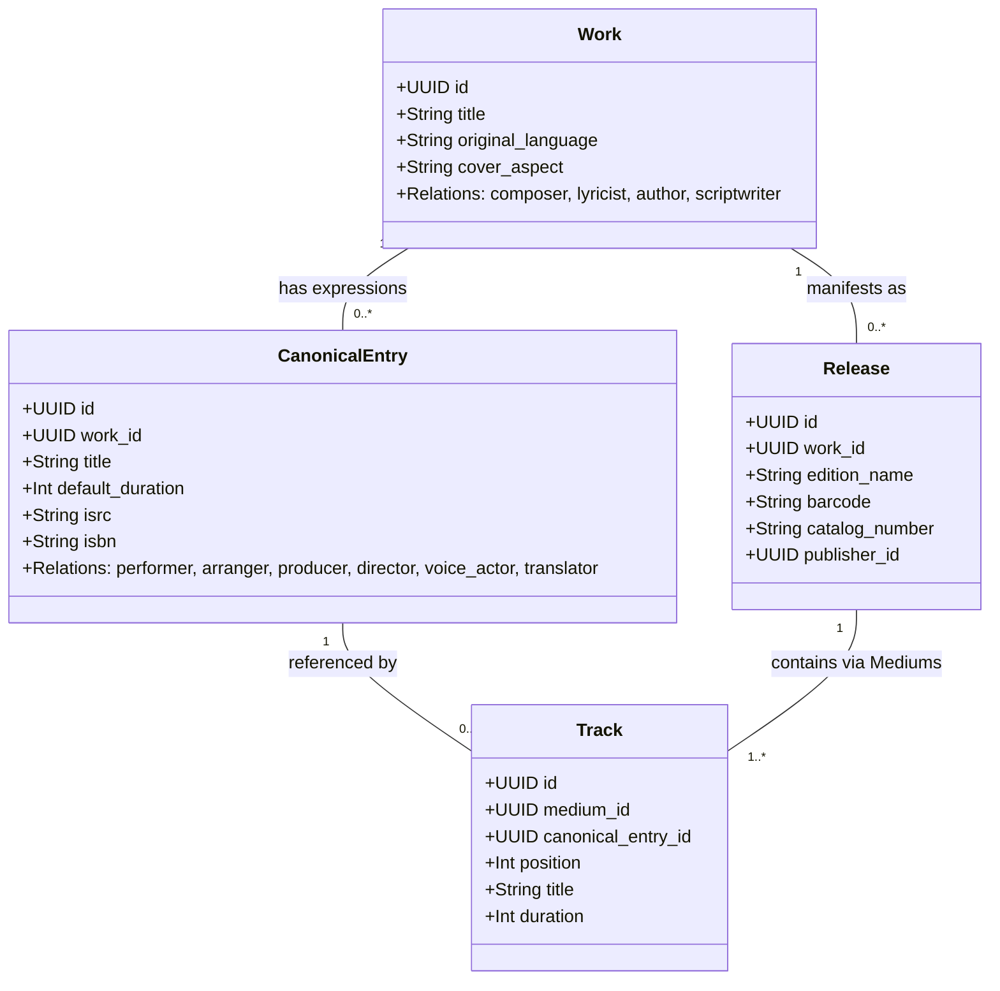

# IFLA LRM 增强版实体模型体系 (LRM-Enhanced Architecture)

::: warning 文档与实现存在差异（一手提示）
本页的 **CanonicalEntry（LRM-E2）实体在当前实现中不存在**，实际固定实体骨架为八类：`agent / collection / work / content_unit / expression / release / medium / track`（见 `backend/internal/catalog/types.go`）。可复用的「表达」由 `Expression` 承载，同作品内目录由 `ContentUnit` 承载，`Track` 通过 `contents[].expression_id` 收录 `Expression`；不存在 `Artist` / `Franchise` 独立实体（分别由 `agent` kind 与 `collection` kind + 关系表达）。

本页保留 LRM 理论分层与建模哲学的讲解；落地字段与关系请以 [元数据目录教程](/catalog) 与 `/api/catalog/definitions` 为准。
:::

MetaFusion 彻底废弃传统树状分类与硬编码 `media_type` 枚举，采用国际图书馆学联合会（IFLA）制定的 **LRM (Library Reference Model 图书馆参考模型)** 规范，并深度融合 **MusicBrainz 录音母版复用哲学** 与 **现代多媒介流媒体体系**，构建了面向跨媒介（电影、音乐、剧集、文献、动漫、游戏）的 **实体模型 + 核心枢纽**。

---

## 1. 五层核心实体分层体系 (The 5-Layer Hierarchy)

```
┌────────────────────────────────────────────────────────┐
│  LRM-E1: Work (逻辑作品概念层: 纯净题名与核心思想)       │
│  - 纯粹思想与艺术创作概念，如《千与千寻》《范特西》《三体》│
│  - 词曲/原著创作绑定: composer, lyricist, author         │
└───────────────────────────┬────────────────────────────┘
                            │ 1:N 抽象创作演化为具体表现形式
┌───────────────────────────▼────────────────────────────┐
│  LRM-E2: CanonicalEntry (表现层 Expression: 典范篇目)  │
│  - 跨媒介具体创作表达：录音母版/正片剪辑/章节正文/单话/战役│
│  - 表现制作演职绑定: performer, arranger, director, etc.│
│  - 可被多个不同 Release / Track 跨版本自由复用         │
└───────────────────────────┬────────────────────────────┘
                            │ 1:N 商业发行封装 / 复用于多发行版
┌───────────────────────────▼────────────────────────────┐
│  LRM-E3: Release (商业发行版本 / 包装规格)             │
│  - 初回限定盘 CD+BD、4K UHD 铁盒版、精装单行本分卷     │
│  - 商业属性: barcode (ISBN/EAN), catalog_number, 厂牌 │
│    └─ Medium (介质容器: Disc 1, Disc 2, Vol.1)         │
│         └─ Track (物理分轨: 音轨序号、篇目项、母版引用)│
└───────────────────────────┬────────────────────────────┘
                            │ 1:N 数字化持久化
┌───────────────────────────▼────────────────────────────┐
│  LRM-E4: Item / AssetFile (实体单件与存储资产)          │
│  - RustFS / S3 对象存储、SHA-256 校验、原档受控下载    │
└────────────────────────────────────────────────────────┘
```

同时，通过 **LRM-E5 Artist（责任主体）** 与 **Franchise（世界观/企划枢纽）** 构建横跨全生命周期的创作者与制作机构协作关系图谱：

```
[ Collection (世界观/企划枢纽) ] ─── includes ───┐
                                                ▼
[ Agent (责任主体: 创作者/机构) ] ─── credit_for / 精确职位码 ───► [ Work (逻辑作品概念层: 纯净题名) ]
                                                       │
                                                1:N    │ 抽象创作演化为具体表现
                                                       ▼
                                          [ CanonicalEntry (表现层 Expression: 典范篇目) ]
                                                       │
                                                1:N    │ 商业发行包含 / 复用于多 Release
                                                       ▼
                                          [ Release (商业发行版本: 规格/厂牌/条码) ]
                                                       │
                                                1:N    │ 物理介质/分盘/分卷
                                                       ▼
                                            [ Medium (介质容器: Disc / Vol / Reel) ]
                                                       │
                                                1:N    │ 物理音轨/单集分轨/篇目项
                                                       ▼
                                            [ Track (分轨/项: 序号/标题/时长/母版关联) ]
```

---

## 2. LRM 各层实体详细职责与纯净题名准则

| 实体层级 | LRM 对应定义 | MetaFusion 跨媒介自适应职责 | 核心数据字段 | 命名黄金准则 (Pure Title Rule) | 典型违规反例 |
|---|---|---|---|---|---|
| **Work** | 作品概念 (LRM-E1) | 独立的精神与艺术创作概念本体，聚合所有版本、跨媒介改编与翻唱 | `id (UUID)`, `title`, `original_language`, `cover_aspect`, `tags`, `translations` | **只保留最纯粹的原作主名**。<br>如《进击的巨人》、《范特西》、《三体》 | ❌ 包含“第1季”、“TV动画版”、“1080P”、“重制版”、“Vol.1”、“OST” |
| **CanonicalEntry** | 表现形式 (LRM-E2 / Expression) | 抽象 Work 的具体创作实现与可复用篇目/母版内容：<br>• 🎵 **音乐**：典范录音/母版 (Recording/Master Track)<br>• 📚 **图书**：标准篇目/典范章节 (Chapter/Canonical Text)<br>• 🎬 **影视**：正片剪辑/分集母版 (Film Cut/Episode Master)<br>• 🎨 **漫画**：连载话/分篇 (Story Chapter)<br>• 🎮 **游戏**：游戏本体/战役篇章 (Main Scenario/DLC) | `id (UUID)`, `work_id`, `title`, `default_duration`, `isrc`, `isbn`, `attributes` | **母版/篇目原始标准名**。<br>如《晴天 (Master Recording)》、《第1话：给二千年后的你》、《第1章：红月亮》 | ❌ 混入专辑名、混入光盘编号（如“Disc 1 Track 03”） |
| **Release** | 载体发行版 (LRM-E3) | 面向公众的特定物理或数字出版载体形态，具备条码与出版编号 | `id (UUID)`, `work_id`, `edition_name`, `catalog_number`, `barcode`, `publisher_id` | **标明版本规格、卷次、出版方、装帧**。<br>如《范特西（首版CD，BMG唱片，2001）》 | ❌ 泛用模版复制（所有网文都写“网络连载版”）、缺少版本区分 |
| **Medium** | 载体介质容器 | 复合发行版下的独立物理/数字存储盘片或分卷 | `id (UUID)`, `release_id`, `position`, `name`, `format` (CD/BD/Vinyl/Book) | **介质序数与载体名称**。<br>如 `Disc 1 (Feature BD)`、`Vol.1` | ❌ 遗漏分盘、将多盘合为单盘导致序号冲突 |
| **Track** | 物理分轨/项 | 介质载体上的具体音轨、影片章节或书籍分册条目 | `id (UUID)`, `medium_id`, `canonical_entry_id`, `position`, `title`, `duration` | **分轨序号 + 轨/项题名**。<br>如 `1. 爱在西元前 (03:43)`、`第1章：红月亮` | ❌ 序号颠倒、时长填 0、未绑定典范条目 |
| **Item / Asset** | 实体单件/资产 (LRM-E4) | 存储节点上的具体数字化文件与物理特征 | `s3_key`, `file_size`, `sha256`, `mime_type`, `binding_role` | 物理资产文件（受控媒体流与 SHA256） | ❌ 盗链外站易失效 URL |
| **Artist** | 责任主体 (LRM-E5) | 参与创作、演出、制作、出版的个人、虚拟角色、团体或法人机构 | `id (UUID)`, `name`, `type` (Person/Group/Studio), `aliases`, `translations` | **规范标准原名**（如“周杰伦”、“吉卜力工作室”） | ❌ 按单部作品重复创建主体 |
| **Franchise** | 世界观企划枢纽 | 聚合同一世界观下的跨媒介作品线与宇宙 | `id (UUID)`, `name`, `description`, `translations` | **世界观/系列标准名**（如“三体宇宙”、“Fate 系列”） | ❌ 为作者个人作品全集建企划 |

---

## 3. 抽象创作与表现层实现的严格分离与跨发行复用机制

### 3.1 创作者 (Work Level) 与 表现演职制作主体 (CanonicalEntry / Expression Level)

在传统低精度数据库中，作词、作曲、编曲、演唱、编剧、监督常被混为一谈。MetaFusion 实行严格的层次化演职隔离：



- **Work 级创作关系**：
  - `composer`（作曲者）：写出旋律与和弦的主体（如：周杰伦、久石让）；
  - `lyricist`（作词者）：创作歌词的主体（如：方文山、林夕）；
  - `author`（原著作者）：文学创作者（如：刘慈欣、尾田荣一郎）；
  - `scriptwriter`（剧本原案）：剧作创作者。
- **Expression 级表现制作关系**（当前实际关系码）：
  - 音乐：`performed_by`（演唱/演奏）、`arranged_by`（编曲）、`composed_by`（作曲）、`lyricist_of`（作词）；
  - 影视/动画：`directed_by`（导演/监督）、`written_by`（编剧）、`voiced_by`（配音演员，`character` 引用角色实体）；
  - 文学/漫画：`illustrated_by`（插画者）、`narrated_by`（朗读/旁白）；
  - 无贴切职位码的署名（录音制作人、音响监督等）用 `credit_for` 承载，职位原文落 `credit_role`。

### 3.2 表现篇目复用与「Appears on Releases」跨发行反查原理

当同一个典范创作表达（如《晴天》2001 原版录音母带、电影《千与千寻》正片公映母版、小说《三体》正文章节）在多个商业发行版中出现时：
1. **单次创建**：仅在库中保留一个具有全局唯一 UUID 的 `CanonicalEntry`（可包含 ISRC / ISBN / EIDR 编码）；
2. **多点引用**：
   - **音乐**：Release A（2003《叶惠美》首版 CD）的 Medium 1 Track 3、Release B（2004《Initial J》日本精选集）的 Medium 1 Track 1、Release C（2020《周杰伦20周年黑胶大套装》）的 Disc 4 Track 3 共同引用同一个 `CanonicalEntry`；
   - **影视**：Release A（日本院线初版蓝光）、Release B（4K UHD 典藏铁盒版）、Release C（流媒体重映版）共同引用同一个电影正片母版 `CanonicalEntry`；
   - **图书**：Release A（初版平装本）、Release B（精装典藏本）、Release C（电子书连载版）共同引用同一个章节正文 `CanonicalEntry`；
3. **反向索引**：系统无需冗余复制单曲/章节/正片元数据，通过 SQL `JOIN tracks ON tracks.canonical_entry_id = canonical_entries.id JOIN mediums ... JOIN releases ...` 即可实时反查出该篇目收录于哪些商业发行版（Appears on Releases）。

---

## 4. 多作品合集与豪华盒装 (Multi-Work Boxsets) 建模规范

### 4.1 教学案例：宮崎駿監督作品集 (13BD Boxset) vs. 千与千寻单行本

```
[ 单行本 Release: VWBS-1530 ] ─────────► 属于单部作品 ─────────► [ Work: 千与千寻 ]
(1 BD-50, 日本院线初版)                                             ▲
                                                                    │
[ 13BD 豪华盒装 Release: VWBS-1531 ]                                 │
   ├── Medium 01: 鲁邦三世 卡里奥斯特罗之城 (BD) ── Track 1 ──► [ Work: 鲁邦三世 ]
   ├── Medium 02: 风之谷 (BD)                 ── Track 1 ──► [ Work: 风之谷 ]
   ├── Medium 03: 天空之城 (BD)               ── Track 1 ──► [ Work: 天空之城 ]
   ├── Medium 04: 龙猫 (BD)                   ── Track 1 ──► [ Work: 龙猫 ]
   ├── Medium 05: 魔女宅急便 (BD)             ── Track 1 ──► [ Work: 魔女宅急便 ]
   ├── Medium 06: 红猪 (BD)                   ── Track 1 ──► [ Work: 红猪 ]
   ├── Medium 07: 幽灵公主 (BD)               ── Track 1 ──► [ Work: 幽灵公主 ]
   ├── Medium 08: 千与千寻 (BD)               ── Track 1 ───┘ (精准回溯)
   ├── Medium 09: 哈尔的移动城堡 (BD)         ── Track 1 ──► [ Work: 哈尔的移动城堡 ]
   ├── Medium 10: 悬崖上的金鱼姬 (BD)         ── Track 1 ──► [ Work: 悬崖上的金鱼姬 ]
   ├── Medium 11: 起风了 (BD)                 ── Track 1 ──► [ Work: 起风了 ]
   ├── Medium 12: 特典盘 1 (On Your Mark & 宣传片)
   └── Medium 13: 特典盘 2 (引退记者会等)
```

- **严禁反例**：在《千与千寻》单部作品页面上填入 `catalog_number = "VWBS-1531"`（这是 13 碟大盒装，不是千与千寻单碟！）。
- **正解流程**：
  1. 《千与千寻》作品页挂载 `VWBS-1530` 单碟蓝光；
  2. 独立创建汇编作品《宮崎駿監督作品集》，其下挂载 `VWBS-1531` 发行版；
  3. 创建 13 个 Medium，Medium 8 的 Track 关联《千与千寻》电影母版；
  4. 建立图谱边 `宮崎駿監督作品集 includes 千与千寻`（当前无 `included_in` 关系码）。

---

## 5. 跨媒介世界观企划 Hub 与 DAG 拓扑图谱 (Franchise & DAG Topology)

### 5.1 实体连接矩阵与拓扑约束 (Graph Connectivity Matrix)

> **关系码修正**：下表为当前 definitions 种子的实际关系码（见 `backend/internal/catalog/defaults.go`，运行时清单以 `GET /api/catalog/definitions` 为准）。旧版本页引用的 `part_of_franchise / creator_of / included_in / crossover_with / prequel_of / spin_off_of / expansion_of / remake_of / member_of / voice_actor_of / imprint_of / real_counterpart_of / alternate_form_of / phonographic_copyright` **均不存在**，请勿据此写入。

| 源实体 kind (Source) | 目标实体 kind (Target) | 实际关系码 (`type`) | 语义与拓扑约束 |
|---|---|---|---|
| **collection / work** | **work / collection** | `includes`（组成包含 / 组成属于） | 企划聚合与嵌套（如系列包含子作品、FGO 属于 Fate 系列），有向无环 |
| **work** | **work** | `adaptation_of`、`sequel_of`、`soundtrack_of` | 改编、续作、原声带；严格有向无环，禁止自环 |
| **expression** | **expression** | `translation_of`、`revision_of`、`cover_of`、`alternate_take_of` | 表达层派生关系（译本、修订、翻唱、别版），有向无环 |
| **release** | **release** | `pressing_of`（再版自） | 版次链，有向无环 |
| **work / content_unit / expression / release** | **agent** | `created_by`、`performed_by`、`photographed_by`、`modeled_by`、`developed_by`、`voiced_by`、`composed_by`、`lyricist_of`、`arranged_by`、`directed_by`、`written_by`、`illustrated_by`、`narrated_by`；通用兜底 `credit_for` | 演职署名；`credit_for` 用于无贴切职位码的来源，职位原文落 `credit_role`；同一声优多角色用多条 `voiced_by` 并以 `character` 引用角色实体 |
| **agent** | **work / collection** | `character_in`（角色登场 / 登场角色） | 虚构角色、团体登场；方向与署名关系相反；同一角色跨作品多条边，番位落 `role`，原始文本落 `credit_role` |
| **expression** | **release / medium** | `bonus_included_in`（特典收录于） | 特典内容归属，有向无环 |
| **expression / release** | **agent** | `store_bonus_for`（渠道特典归属） | 店铺特典归属渠道/主体，有向无环 |

成员/团体、现实对照、角色形态变体等旧概念当前没有专用关系码；如需新增，应经 DefinitionsEditor 草稿→影响→发布添加，不改代码。

---

## 6. 消除 `media_type` 的四重正交表达体系

MetaFusion 坚决反对在主表强加 `media_type` 枚举。作品形态由四重维度正交决定：

1. **业务类型 (`types`) 与自由标签 (`tags`)**：
   - `types` 挂载业务形态（如 `animation`、`album`、`single`、`novel` 等），驱动服务端动态字段方案与展示模板；
   - `tags` 是平铺、自由的检索词（如 `["科幻", "赛博朋克", "治愈", "同人", "摇滚"]`），不设人为分组；
2. **封面画幅 (`cover_aspect`)**：
   - `"1:1"` (音乐唱片/OST)；
   - `"2:3"` (电影/动画海报)；
   - `"3:4"` (书籍/漫画/单行本)；
3. **Release 载体规格**：
   - Medium `format`: `Paperback`, `Hardcover`, `CD`, `Vinyl`, `Blu-ray`, `UHD-BD`, `Digital Book`, `Digital Album`；
4. **实体图谱边 (`entity_relationships`)**：
   - 通过 `adaptation_of`、`sequel_of`、`soundtrack_of` 自然表达媒介演变（无 `spin_off_of`，衍生关系经后台 definitions 扩展）。

---

## 7. 典型编目案例实战

- **明日方舟**：企划 = collection；游戏本体 = Work；国服/日服/国际服 = 同一 Work 下多条 Release（`country` + `attributes.catalog_metadata.server`）；终末地 = 另一 Game Work；官方漫画各为 Comic Work；塞壬唱片 = agent `organization`（厂牌归属当前无专用关系码，需后台 definitions 扩展）；OST = Music Work，通过 `soundtrack_of` 连接游戏。
- **BanG Dream!**：企划 = collection（经 `includes` 聚合作品）；游戏与各季动画各为 Work；2D 乐队 = 角色/团体 agent，现场声优乐队 = `group` agent；角色与 CV 为多条边：`voiced_by`（work → agent，`character` 引用角色实体）与 `character_in`（agent → work），语言用 `language` / `context` 区分。
- **Fate / FGO**：Fate 为父 collection，FGO 为子 collection（`includes`）；FSN 三条路线 = 同一 Work 下的 ContentUnit / Expression，不拆三部 Work；Saber / Saber Alter = 两个 agent（角色形态变体当前无专用关系码）；分服仍是 Release。
- **魔禁 / 超电磁炮**：学园都市 = 父 collection；旧约 22 卷 = **一部** Novel Work + 22 条 Release；新约卷号重置 = 新 Work + `sequel_of`；超炮已跨媒介 → 子 collection；美琴跨作品登场 = 同一角色多条 `character_in`。
- **个人创作者**：久石让 / wowaka 的枢纽是 agent 页，不建「某某宇宙」collection。单曲经 `includes` 归入专辑/精选集；Vocaloid 曲指向虚拟歌手 agent 而非声库公司。

---

## 8. 延伸阅读

- [权威编目与元数据审查准则](/curation-guide)
- [AI Agent 接入与自动化编目协作指南](/agent-integration)
- [分类体系与动态标签](/taxonomy)
- [开发者 API 概览](/api-overview)
